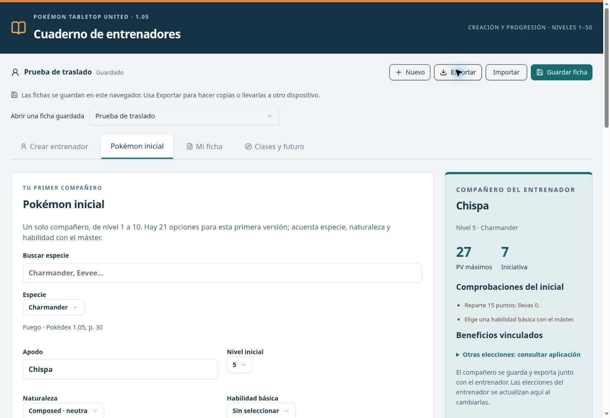

# PTU Manager · Cuaderno de entrenadores

Versión independiente del cuaderno de entrenadores de PTU 1.05, en español, preparada para GitHub Pages. Conserva el diseño y el contenido del proyecto original y funciona sin cuentas, servidores propios ni inicio de sesión en ChatGPT.



## Qué incluye

- Ficha de entrenador de nivel 1 a 50: identidad, historia, habilidades y estadísticas.
- 39 clases y un catálogo de 502 entradas entre clases, ventajas, rasgos y opciones concedidas.
- Requisitos, presupuestos de elecciones, comprobaciones y consulta de clases futuras.
- Botones **Editar** y **Quitar** en el creador y la ficha, avisos de dependencias antes de aplicar cambios y **Deshacer** para la última elección modificada.
- Planificador de clases: requisitos cumplidos, a un requisito, confirmaciones pendientes y clases ya elegidas.
- Reglas rápidas de turnos, acciones, cambios de Pokémon y progresión, con páginas del manual consultables.
- Un Pokémon inicial, con 21 especies disponibles, naturaleza, movimientos y comparación de beneficios del entrenador.
- Varios entrenadores guardados en el navegador e importación/exportación de archivos JSON.
- Referencias de página al manual y texto original consultable. Algunas descripciones conservan el inglés.

## Publicar en GitHub Pages

1. En el repositorio, abre **Settings → Pages**.
2. En **Build and deployment → Source**, selecciona **GitHub Actions**.
3. En **Actions**, ejecuta **Publicar cuaderno en GitHub Pages → Run workflow**, o sube un cambio a `main`.
4. Al terminar, GitHub muestra la dirección de la web en **Settings → Pages** y en el despliegue.

El flujo instala las versiones fijadas, ejecuta las pruebas y la comprobación de tipos, construye `dist/` y publica esa carpeta. Los recursos usan rutas relativas para funcionar tanto en `/PTU_Manager/` como en un dominio propio.

## Trasladar tus fichas desde la página anterior

1. Abre una ficha en la web original y pulsa **Exportar**.
2. En esta web, pulsa **Importar** y elige el archivo `.json`.
3. Comprueba el entrenador y su Pokémon inicial y pulsa **Guardar ficha**.
4. Repite para los demás entrenadores.

Los archivos mantienen el formato `ptu-trainer-v1`. Las fichas de la nube no se copian automáticamente y la web anterior sigue siendo independiente.

Las fichas ya guardadas en GitHub Pages siguen siendo compatibles. En **Crear y editar → Clases y rasgos** o **Mi ficha**, usa **Editar** para cambiar la configuración, especialización o presupuesto. Para cambiar de clase o rasgo, quita la elección anterior y añade la nueva. Los rasgos dependientes se conservan y quedan señalados para revisión. **Deshacer** permanece disponible hasta el siguiente cambio en el borrador.

**Guardar ficha** conserva los datos únicamente en ese navegador y dispositivo. No se sincronizan con GitHub ni con otros jugadores. Borrar los datos del sitio o usar navegación privada puede hacer que dejen de estar disponibles; usa **Exportar** para conservar una copia o cambiar de dispositivo. Los cambios de una pestaña no sobrescriben una revisión más reciente sin avisar.

## Trabajar en tu computadora

Requisitos: Node.js 24 y pnpm 11.25.0 (la versión está fijada en `package.json`).

```sh
pnpm install --frozen-lockfile
pnpm dev
```

Abre la dirección que indique Vite. Para comprobar y generar la web:

```sh
pnpm test
pnpm typecheck
pnpm build
pnpm preview
```

`dist/` contiene la web publicable. Sirve esa carpeta por HTTP; abrir `index.html` mediante `file://` no sustituye a un servidor web.

## Dónde cambiar cada cosa

| Archivo | Contenido |
| --- | --- |
| `app/page.tsx` | Creador, ficha y consulta de progresión |
| `app/globals.css` | Colores, estilos y adaptación de pantalla |
| `components/starter-panel.tsx` | Interfaz del Pokémon inicial |
| `components/choice-list.tsx` | Elecciones con edición, eliminación y avisos |
| `components/class-planner.tsx` | Clases disponibles y próximos requisitos |
| `components/quick-reference.tsx` | Resúmenes para consultar durante la partida |
| `lib/ptu.ts` | Reglas y cálculos del entrenador |
| `lib/choices.ts` | Edición, dependencias y planificación de clases |
| `lib/starter.ts` | Cálculos y beneficios del Pokémon inicial |
| `lib/storage.ts` | Guardado local y control de revisiones |
| `lib/validation.ts` | Validación de fichas |
| `data/catalog.json` | Catálogo de clases, rasgos y ventajas |
| `data/starters.json` | Especies iniciales disponibles |
| `data/sources.json` | Referencias al manual original |
| `data/reference-pages.json` | Páginas de combate y progresión de Pokémon |
| `.github/workflows/pages.yml` | Publicación automática |

## Alcance

Esta migración conserva las reglas implementadas en el proyecto de origen; no constituye una revisión exhaustiva de todas las excepciones de PTU. Los efectos situacionales y los requisitos que dependen del equipo o de la mesa siguen requiriendo confirmación. La selección de Pokémon se limita a las 21 especies iniciales incluidas, no a una Pokédex completa.

Material de referencia: Pokémon Tabletop United 1.05 y su Pokédex. Proyecto de aficionados, sin afiliación oficial. Se conservan las atribuciones de los componentes de terceros en `vendor/`.
